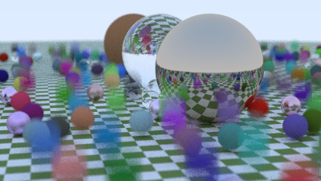
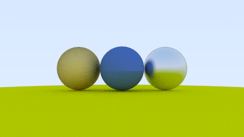
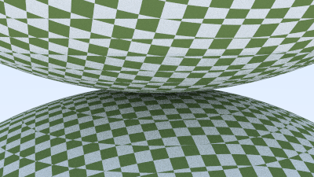

# A Rust Raytracer

An implementation of a raytracer from first principles of graphics programming based upon the series _Raytracing in One Weekend_. Various graphical features are included such as

#### Geometries

- [x] Spherical intersection
- [x] Quad intersection
- [x] Instancing translation and rotation

#### Textures

- [x] Texture mapping
- [x] Solid color
- [x] Checkered

#### Materials

- [x] Lambertian
- [x] Dielectrics
- [x] Metals

- [x] Emissive Lights
- [x] Volumes

Standard acceleration techniques for the raytracing algorithm are available like **bounded volume hierarchy** for sorting the objects in scene according to the bounding boxes and organizing them into a tree-like structure for fastest ray-intersection calculation.

### Explanation of Raytracing Algorithm

Raytracing works by simulating the real-world analog of rays of light traveling from the outside world, scattering across objects, before eventually entering the apeture of the camera in the scene. Using the optical magic of **Helmholtz's reciprocity**, which states that a ray and its reverse will follow essentially identical optical adventures from reflections, refractions, and absorbtion into media present in the scene, we can perform this process in reverse and instead shoot numerous simulated rays out of a source in 3D space, track where they pass through a flat "image screen" in front of the camera source, and then follow their subsequent optical path. The end "color" of this single ray is calculated from a combination of values accumulated onto the ray along its path from scattering off world objects; different materials and properties of the objects will contribute to this as well as the ray's path in different ways. Further, the resultant color becomes of the color of the pixel on the "image screen" we placed in front of the camera in the first place - with some additional complexities.

See some example outputs below!

### Examples

Motion blur spheres with a variety of materials

Metallic Materials

Checkered Textures

